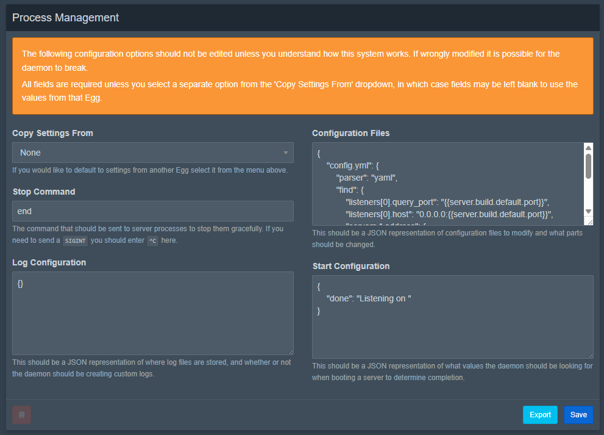

# Config Parser
## Format
The **config parser** modifies (config) files when a server starts.
This ensures that essential server settings are **defined**, **modified**, and **injected dynamically** before the server starts.



## How It Works

:::warning
Using configuration file parsing is generally an advanced feature. If you are new to creating eggs, you may skip this section unless your egg needs it.
:::

This section allows you to define files that Pterodactyl should automatically modify each time the server starts, to ensure certain settings are always applied. You can provide a JSON object mapping file names to the values that should be set in those files. Wings will then parse and update those files before the server fully starts.

For example, consider a game that uses a `server.properties` file for its settings. You might add a configuration entry like this:

```json
{
  "server.properties": {
    "parser": "properties",
    "find": {
      "server-ip": "0.0.0.0",
      "server-port": "{{server.build.default.port}}",
      "max-players": "{{env.MAX_PLAYERS}}"
    }
  }
}
```

Each time the server starts, Wings checks if `server.properties` exists:
- If it exists, Wings will update those keys to the defined values (inserting the key if it’s missing).
- If the file doesn’t exist, Wings will create it with those keys and values.

A more advanced example using a YAML file and wildcards:

```json
{
  "config.yml": {
    "parser": "yaml",
    "find": {
      "listeners[0].query_enabled": true,
      "listeners[0].query_port": "{{server.build.default.port}}",
      "listeners[0].host": "0.0.0.0:{{server.build.default.port}}",
      "servers.*.address": {
        "127.0.0.1": "{{config.docker.interface}}",
        "localhost": "{{config.docker.interface}}"
      }
    }
  }
}
```

## Parser Types
The available Parser Types are:
| Type | Description |
|------|-------------|
| `properties` | `.properties` files with key=value pairs |
| `ini` | Supports `[sections]` and `key=value` pairs |
| `yaml` | Handles nested keys, supports wildcards |
| `json` | Parses full structure, adds missing keys |
| `xml` | Can update attributes/values via xpath |
| `file` | Simple find/replace by line content (avoid if possible) |
