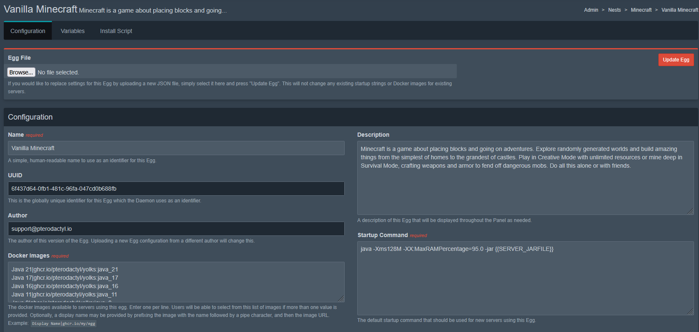
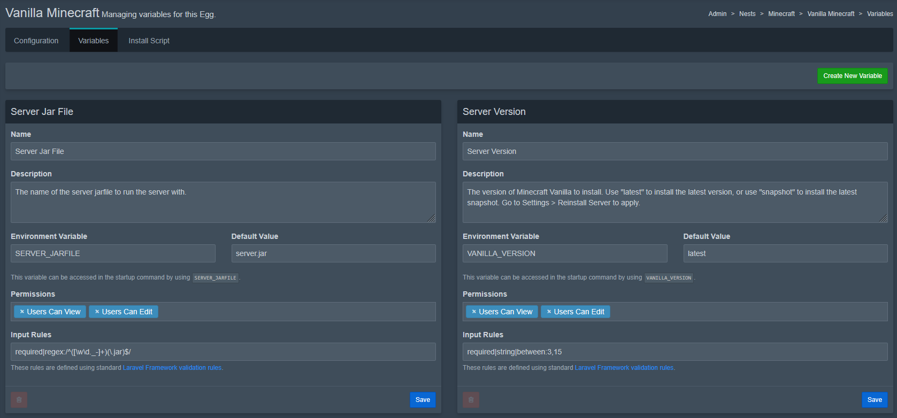

# Egg Components
On this page we'll focus on explaining the different core components of an egg.

These are very important to have a general understanding of for making your own eggs!

## Configuration Tab
This tab includes some very important base info and configs about your egg.



### Basic Details
- **Name** - This is the name you set for your egg

- **Description** - A short description of the Egg

- **Author** - Your E-Mail that end users can contact you with for support with the egg

### Docker Images
:::caution
This image will need to have all the packages your egg needs to run! Packages installed during the install script are only available during the install!
:::

Here you can select the base image the container will run, there are various images already available from the pterodactyl team in their [yolks repository](https://github.com/pterodactyl/yolks).

You can also add multiple images to let the user choose which image they want to run the egg in, one per line, as well as add a display name.

Example: ``Display Name|ghcr.io/my/egg``

### Startup Command
This is what command the container will run on each press of the Start button on the installed Server

Example: ``.\service --port {{SERVER_PORT}}``

### Stop Command
This is the command the container will run if the end user presses the "Stop" button on the installed server.

Example: ``^C``

### Log Configuration
:::info
This section still needs some clarification, feel free to contribute!
:::

In Pterodactyl 1.x, log configuration is usually left empty, because Wings streams all container output by default, it looks like:
```json
{}
```
## Configuration Files
:::caution
This is generally recommended for advanced users and not very advisable for newcomers to making eggs.
:::
### What do you use Configuration files for?
You can set up configs the game or service will use and make them modifiable using the [Config Parser](../egg-advanced/config-parser.md).

### Startup Configuration
This is a json string of words or phrases that the Wings service will look for in the console output of your egg in order to determine if it finished starting up or not.

Example:
```json
{
    "done": [
        "text here"
    ]
}
```

## Variables Tab
This is where you can define new custom Variables, see [Egg Basics - Custom Variables](egg-variables#custom-variables) for more info on that topic.



## Install Script Tab
:::caution
Any Packages installed in the script container will be removed after installation is complete! Make sure all needed packages are in your docker image in the configuration tab as stated above!
:::
Here is where you can write your [Install Script](install-script.md) and define the script container/docker image your script will run in

The official yolks installers images (Alpine or Debian based) provide common tools like curl and unzip pre-installed to speed up installs


The commonly used installation Images are;

- ``ghcr.io/ptero-eggs/installers:alpine``
- ``ghcr.io/ptero-eggs/installers:debian``
- ``ghcr.io/ptero-eggs/installers:ubuntu``

You can find the installation images here - [Installation Yolks](https://github.com/Ptero-Eggs/yolks?tab=readme-ov-file#installation-images)


