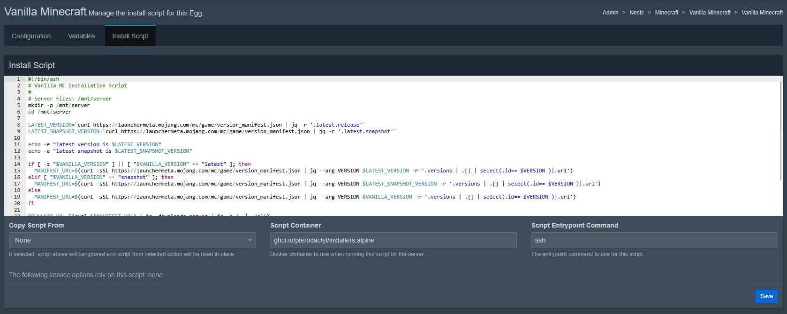

# Egg Components
On this page we'll focus on explaining the different core components of an egg.

These are very important to have a general understanding of for making your own eggs!

# Configuration Tab
This tab has some very important base info and configs about your egg in it.


## Basic Details
**Name** - This is the name of your Egg

**Description** - A short description of the Egg

**Author** - Your E-Mail that end users can contact you with for support with the egg

### Docker Images
:::caution
This image will need to have all the packages your egg needs to run! Packages installed during the install script are only available during the install!
:::

Here you can select the base image the container will run, there are various images already available from the pterodactyl team in their [yolks repository](https://github.com/pterodactyl/yolks).

You can also add multiple images to let the user choose which image they want to run the egg in, one per line, as well as add a display name.

Example: ``Display Name|ghcr.io/my/egg``

### Startup Command
This is what command the container will run on each press of the Start button on the installed Server

Example: ``.\service --port {{SERVER_PORT}}``

## Process Management
This section of the configuration tab focuses mainly on configs for logging, files, config files, etc.

### Stop Command
This is the command the container will run if the end user presses the "Stop" button on the installed server.

Example: ``^C``

### Log Configuration
:::info
This section still needs some clarification, feel free to contribute!
:::

This section is for a JSON string telling the egg where log files are stored, and whether the daemon should be creating custom logs or not.

### Configuration Files
Here you can set up configs the game or service will use and make them modifiable using the [Config Parser](../egg-advanced/config-parser.md).

:::caution
This is generally recommended for advanced users and not very advisable for newcomers to making eggs.
:::

### Startup Configuration
This is a json string of words or phrases that the Wings service will look for in the console output of your egg in order to determine if it finished starting up or not.

Example:
```json
{
    "done": [
        "Finished startup process successfully!"
    ]
}
```

# Variables Tab
This is where you can define new custom Variables, see [Egg Basics - Custom Variables](egg-variables#custom-variables) for more info on that topic.


# Install Script Tab
Here is where you can write your [Install Script](install-script.md) in bash and define the script container/docker image your script will run in

:::caution
Any Packages installed in the script container will be removed after installation is complete! Make sure all needed packages are in your docker image in the configuration tab as stated above!
:::

