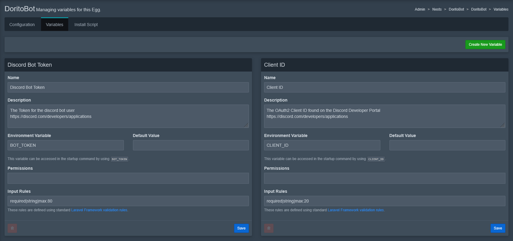

# Egg Variables

Each egg in Pterodactyl supports **Variables** that you can use in either the **Install Script** or the **Config Parser**. These variables provide a dynamic way to configure your server behavior and are highly useful for customization and modular egg design.

Variables are divided into two main types:

- **Default Variables**: Automatically injected by the panel and wings.
- **Custom Variables**: Defined manually in the "Variables" tab of the egg.



## Default Variables

These are injected into every server environment by default and can be referenced using the following syntaxes:

- In scripts: ``${VARIABLE_NAME}`` or ``{{server.build.default.VARIABLE_NAME}}``
- In config parsers: ``{{server.build.default.VARIABLE_NAME}}``

| Variable Name             | Description                                                              | Example                  |
|---------------------------|--------------------------------------------------------------------------|--------------------------|
| `TZ`                      | Time Zone set in the panel's `.env` file                                 | `Etc/UTC`                |
| `STARTUP`                 | The actual resolved startup command for the server                       | `./run.sh -arg1`         |
| `SERVER_MEMORY`           | Allocated memory for the server in megabytes                             | `1024`                   |
| `SERVER_IP`               | The IP address assigned to the primary allocation                        | `192.168.1.10`           |
| `SERVER_PORT`             | The main port assigned to the server                                     | `27015`                  |
| `P_SERVER_LOCATION`       | The name of the location (set by the admin in the panel)                 | `Amsterdam-01`           |
| `P_SERVER_UUID`           | UUID of the server instance (used for tracking within Wings)             | `ab12cd34-5678-90ef-ghij-klmn12345678` |
| `P_SERVER_ALLOCATION_LIMIT` | The maximum number of allocations available to this server (if set)    | `3`                      |
| `USER`                    | The user executing processes inside the container                        | `container`              |
| `HOME`                    | The home directory inside the container                                  | `/home/container`        |

> These variables are especially useful when creating multi-purpose install scripts or handling conditional logic based on port, memory, or UUID.

## Custom Variables

In addition to defaults, you can define your own **Custom Variables** in the egg configuration under the "Variables" tab. These are used to allow users or admins to provide input or modify parameters without directly changing the startup command.

They are referenced as:

- In scripts: ``${ENV_VAR}`` or ``{{env.ENV_VAR}}``
- In config parsers: ``{{env.ENV_VAR}}``

Each custom variable allows you to define:
- A default value
- Description (shown to the user in the panel)
- Rules (validation, required or not)
- Whether it is viewable or editable by the user

Example use in a config parser:
```json
{
  "server.properties": {
    "parser": "properties",
    "find": {
      "server-port": "{{server.build.default.port}}",
      "max-players": "{{env.MAX_PLAYERS}}"
    }
  }
}
```

> With custom variables, you can make your egg fully customizable while hiding sensitive or complex settings from end-users.

## Best Practices

- Use **UPPERCASE** for all variable names.
- Clearly document custom variables with helpful descriptions.
- Avoid redefining default variable names as custom ones.
- Use fallback values where applicable in scripts.
- Always validate inputs if used in file paths, URLs, or commands.
