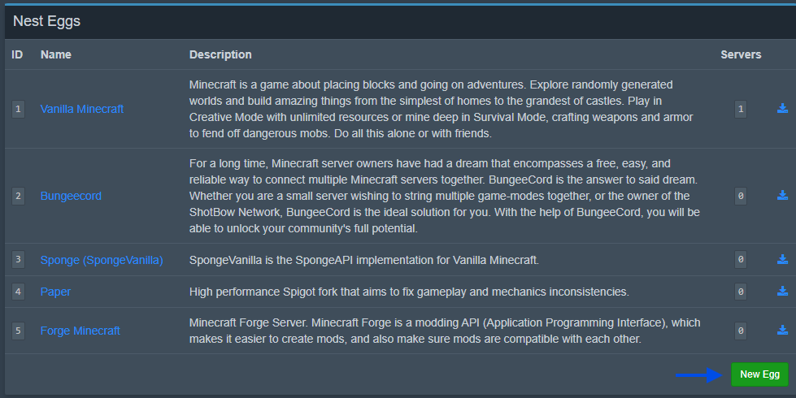

# Nests Page
The nests page is where Eggs live, nests are a collection of eggs, sort of like a category for eggs that fit into a specific class i.e. belong to the same Game, Service, etc.

This page can be found by navigating to the Admin Dashboard, towards the very bottom of the left sidebar.

## Creating a New Nest (Category)

If your egg doesn’t fit into an existing Nest, you should create a new Nest for it. The Nests page can be found in the Admin Dashboard (in the left sidebar, near the bottom).

Click the **“Create New”** button on the Nests page to create a new Nest. You will need to provide:

- **Name:** A descriptive name for the category (for example, “Custom Games” or “Minecraft Mods”).

- **Description:** (Optional) Details about what eggs in this nest are for.

Once these are filled, save the new Nest.

:::tip
If you have a pre-made egg (for example, from the community), you can import it instead of creating one from scratch. Use the **Import Egg** button on the Nests page, select the target Nest, and upload the egg’s JSON file. Check out the [Community Egg Repository](https://pterodactyleggs.com) for a large selection of ready-to-use community eggs.
:::

## Creating a New Egg

After you have a Nest, you can create a new Egg within that nest. To do this, navigate to the nest’s detail page, then click the **New Egg** button at the bottom of the page.

This opens the egg configuration form (the “New Egg” page). If not already selected, choose the appropriate Nest from the **Associated Nest** dropdown at the top of the form.

Now fill out the details for your new Egg:

### Basic Details

- **Name:** The name of the Egg (e.g. “MyGame Dedicated Server”). This is how the egg will be listed in the panel.

- **Description:** A short description of what this egg is or does.
