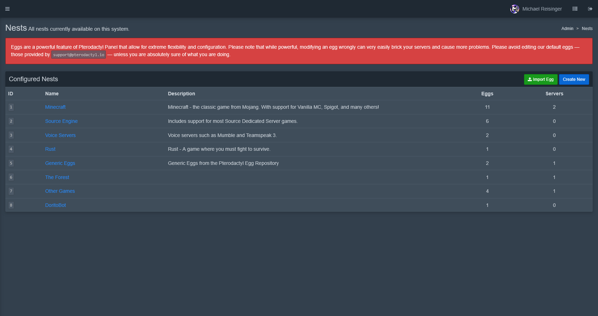

# Nests Page
The nests page is where Eggs live, nests are a collection of eggs, sort of like a category for eggs that fit into a specific class i.e. belong to the same Game, Service, etc.

This page can be found by navigating to the Admin Dashboard, towards the very bottom of the left sidebar.

## Creating a new Nest
On the top right, you will see two buttons labeled **"Import Egg"** and **"Create New"**
To create a new Nest, click the **"Create new"** button, Or select an existing Nest to manage it.

## Creating a new Egg
To create an Egg, open an existing Nest.
Then click the **"New Egg"** button at the bottom of the page.

For more info check out the [Making your first Egg](../tutorials/first-egg.md) Tutorial.

